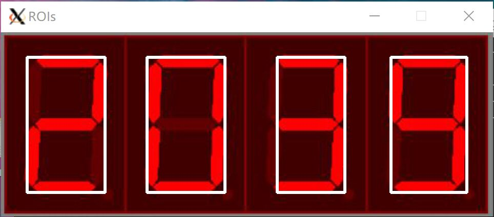
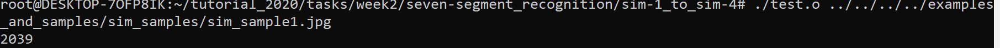
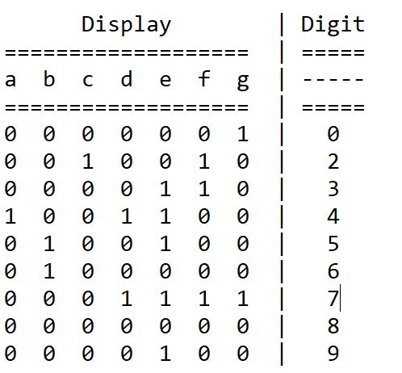

## Digit Programme

- Author: ChenBoYang
- Revised: ChenBoYang
- Date: 2020-10-11
- Version: 2.0.0
- Abstract: tutorial about programmes for recognizing digits.

### 函数:
    fastNlMeansDenoisingColored // opencv2/photo.hpp，消除高斯噪声
    GaussBlur // opencv2/imgproc.hpp，高斯滤波
    threshold // opencv2/imgproc.hpp，二值化
    getStructuringElement // 生成形态学运算核
    morphologyEx // 形态学运算
    dilate // 形态学膨胀
    erode // 形态学腐蚀
    findContours // 获取轮廓

### 接口:
    void recognition(Mat& input); // 使用“穿线法”识别 input 中的数字

    Mat preprocess(Mat& input); // 对输入图像 input 的预处理， 包括:
                                // 消除高斯噪声
                                // 分离 BGR 通道
                                // 对 R 通道应用高斯滤波
                                // 对 R 通道二值化
                                // 对 R 通道应用形态学开运算;
                                // 对 R 通道应用形态学闭运算;
    
    vector<Rect> findNumbers(Mat&); // 返回 Rect 对象的 vector 容器，其中每个 Rect 对象
                                    // 代表输入图像中的一个待识别的数字

### 依赖库:
    opencv4.5.0-pre

### 配置CMakeLists.txt:
    $ cp ./CMakeLists.txt ./sim-1_to_sim-4

### 调试：
    $ cd ./sim-1_to_sim-4
    $ cmake .
    $ make
    $ ./test ../../../../examples_and_samples/sim_sample/sim_sample1.jpg

### 结果：

### 其他：
- 对 sim_sample5.jpg，尝试应用1.调节HSV的S通道值和2.调用illuminationChange函数消除高亮光源，但效果不理想

- “穿线法”识别数码管数字：
    - 以 a~g 按顺序标记数码管的7段管，值为0代表不亮，值为1代表亮
    - 由于 1 较特殊，其长宽比例最大，故可以提前判断
    - 其余数字，按 4 2 7 0 3 5 6 9 8 的顺序判断可以通过最少的运算得到结果
    - 